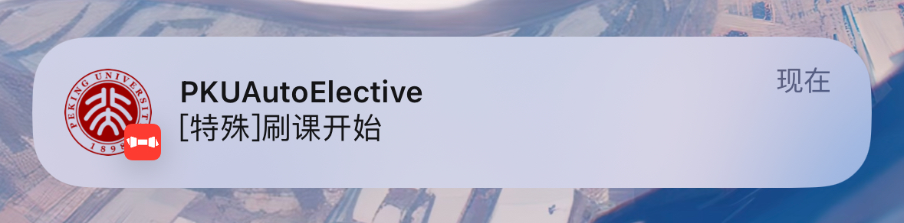

# PKUElective2026Spring (Hardened / 2026+)



北大选课辅助工具（强化版）：在经典 `PKUElective2022Spring`/`PKUAutoElective` 系列的基础上，补齐了“上线前预检、只读演练、抽签期（Phase 1）Runbook、离线 fixtures 回放测试、验证码多模型链路管理（fallback/degrade/adaptive/probe）+评估”这一整套可回归流程，并对稳态与错误恢复做了增强。

## 相比原版的主要改进

- **配置预检（静态、0联网）**：`main.py --preflight` / `scripts/preflight_config.py`，提前发现常见误配置（provider/密钥/刷新间隔/探针开关等）。
- **只读演练（Read-only rehearsal）**：`scripts/rehearsal_readonly.py`，用于在不触发真实选课提交的前提下验证登录、抓页、验证码链路等。
- **抽签期（Phase 1）一套可复制 Runbook**：`PHASE1_PRESTART.md` + `PHASE1_RUNBOOK.md`，把“抓取真实 HTML + 脱敏 + 提升为 fixture + 回归测试”流程固化。
- **离线回放测试与 fixtures 工具链**：支持抓取/脱敏/提升 fixtures，并通过 `unittest` 离线回归覆盖解析容错、退避策略、验证码策略等关键路径。
- **验证码多模型链路管理（核心亮点）**：支持 `provider + fallback_providers` 组成识别链；失败自动 degrade 冷却并可切换识别器；可选 adaptive 自适应排序（按在线 Validate 成功率 + 延迟打分）；可选低频 probe 探针为 adaptive 提供样本；支持采样落盘与跨重启 snapshot。
- **多验证码识别器 + 在线评估脚本**：Baidu / OpenAI-compatible OCR / Gemini；用 `validate.do` 做在线准确率评估与 RTT 基准测量，辅助选择/调参。
- **更保守的稳态与恢复**：支持 not-in-operation 动态退避、会话重置冷却、离线断路器、线程守护重启等，减少“异常导致紧循环”的风险。
- **请求足迹/稳态基线审计 + 回归测试**：`BASELINE_FOOTPRINT_AUDIT.md` / `scripts/audit_baseline_footprint.py`，用 baseline 上界锁定“请求指纹/请求预算/默认开关”，防止默认行为变得更激进。
- **安全护栏**：`cache/`、`config.ini`、`.vscode/` 默认已在 `.gitignore`；并通过测试对 tracked fixtures 做敏感信息扫描，避免 token/cookie/student_id 泄露。

## 小白版教程（旧版入口，仍可参考）

参见 [Arthals' Docs](https://docs.arthals.ink/docs/pku-auto-elective)。

## 安装

> 运行环境：建议 Python 3.10+（优先 3.11/3.12）。依赖管理使用 `uv`。

```bash
git clone https://github.com/JKay15/PKUElective2026Spring.git
cd PKUElective2026Spring
uv sync
```

如未安装 `uv`，先参考官方安装文档：[astral-sh/uv](https://docs.astral.sh/uv/getting-started/installation/)。

## 配置（必读）

首次使用请先复制 `config.sample.ini` 为 `config.ini`：

```bash
cp config.sample.ini config.ini
```

至少需要填写：

- `[user] student_id / password / dual_degree / identity`
- `[captcha] provider` 以及对应 provider 的 key（**不要提交真实密钥**）

如果你需要“临时配置文件”（推荐用于抽签期/线上采样），可以用：

```bash
cp config.ini config.phase1.ini
export AUTOELECTIVE_CONFIG_INI=config.phase1.ini
```

说明：`AUTOELECTIVE_CONFIG_INI` 会强制本进程使用指定配置，避免“模块过早 import 导致单例配置先初始化、-c 失效”的问题。

## 快速开始（主程序）

1) 先跑静态预检（不联网）：

```bash
uv run python main.py --preflight
```

2) 启动主程序：

```bash
uv run python main.py
```

可选：启动本地监控线程（默认 `127.0.0.1:7074`，具体见 `[monitor]`）：

```bash
uv run python main.py -m
```

停止：`Ctrl + C`。

## 只读演练（强烈推荐先跑）

只读演练不会触发 `electSupplement`（即不会真实提交选课），用于确认“登录/抓页/验证码链路”在当前学期可用。

```bash
uv run python scripts/rehearsal_readonly.py -c config.ini
```

默认输出在 `cache/rehearsal/<timestamp>/`（已被 `.gitignore` 忽略）。

## 抽签期（Phase 1）使用方法

抽签期建议按文档执行：

- `PHASE1_PRESTART.md`：上线前检查清单（预检 + 离线回归 + 基线审计 + 只读真实测试）
- `PHASE1_RUNBOOK.md`：抓取真实页面、脱敏、提升 fixture、回归测试与验证码评估

最常用的一条命令是“一键抓取 + 提升 + 脱敏扫描 + 回归”：

```bash
uv run python scripts/phase1_capture_replay.py -c config.phase1.ini --pages 3 --draw-count 5 --sleep 1.0 --strict
```

## 验证码：多模型链路（fallback / degrade / adaptive / probe）

这一部分是本仓库最核心的“工程化增强”之一：不仅仅是“支持多个识别器”，而是把它们组织成一条**可监控、可回归、可自适应**的链路。

### 支持的 providers（示例）

- `openai`：标准 OpenAI-compatible 调用（推荐）
- `baidu`：Baidu OCR
- `gemini`：Gemini Vision OCR
- 任意模型 ID（例如 `qwen3-vl-flash` / `qwen-vl-ocr-2025-11-20` / `your-local-vl`）：自动按 OpenAI-compatible 调用
- `dummy`：离线占位（仅用于测试/调试）

### OpenAI-compatible 调用方式（推荐）

验证码识别走标准 OpenAI-compatible 接口：

- 路径：`POST {base_url}/chat/completions`
- 鉴权：`Authorization: Bearer {api_key}`（本地无鉴权网关可留空）
- 模型：`model_name`

目标就是：只填 `model_name / api_key / base_url` 三项即可跑。  
不需要手动注册模型，也不需要额外改代码。

示例 A：标准写法（推荐）

```ini
[captcha]
provider=openai
model_name=qwen3-vl-flash
api_key=YOUR_DASHSCOPE_KEY
base_url=https://dashscope.aliyuncs.com/compatible-mode/v1
```

示例 B：provider 直接写模型名（同样支持）

```ini
[captcha]
provider=your-vl-model-name
api_key=
base_url=http://127.0.0.1:8000/v1
```

### 1) 识别链（primary + fallbacks）

启动时会把 `provider + fallback_providers` 组装成一个有序列表（去重后保序）：

```ini
[captcha]
provider=openai
model_name=qwen3-vl-flash
fallback_providers=qwen-vl-ocr-2025-11-20,baidu
```

说明：

- 主循环默认使用“当前 provider”；链路的意义在于：当触发 degrade 旋转、或开启 adaptive 重排时，可以自动切换到更稳/更快的 provider。

### 2) degrade 降级策略（避免坏识别器拖死主循环）

当验证码链路连续失败达到阈值（识别异常 / Validate 解析异常 / Validate 失败等都会计入），进入 degrade 冷却窗口：

- `degrade_failures`：触发阈值
- `degrade_cooldown`：冷却秒数
- `switch_on_degrade=true`：触发 degrade 时自动把当前识别器 rotate 到链路下一个（起到 fallback 的效果）
- `degrade_monitor_only=true`：冷却期间**不提交选课**，只做“有名额则通知”（减少无效请求和风险）

```ini
[captcha]
degrade_failures=12
degrade_cooldown=60
switch_on_degrade=true
degrade_monitor_only=true
degrade_notify=true
degrade_notify_interval=60
```

### 3) adaptive 自适应排序（成功率 + 延迟联合打分）

可选开启 adaptive 后，会基于在线 `validate.do` 的通过情况做统计，并定期对 provider 顺序重排。

实现要点（简述）：

- 用 `validate.do` 作为“是否识别正确”的在线判定（pass/fail）
- 对每个 provider 维护 EWMA 延迟与成功率估计（含平滑，避免小样本极端值）
- 打分：`score = p_hat - alpha*t_hat - beta*h_hat`
  - `t_hat`：识别耗时 EWMA
  - `h_hat`：`DrawServlet + validate.do` 的端到端耗时 EWMA（更接近真实链路的网络/服务端长尾）
- `adaptive_epsilon`：只有当 best 显著优于 current 时才切主，减少抖动
- 可选持久化 snapshot，减少重启后的冷启动成本

```ini
[captcha]
adaptive_enable=false
adaptive_min_samples=10
adaptive_update_interval=20
adaptive_epsilon=0.1
adaptive_score_alpha=0.4
adaptive_score_beta=0.6
adaptive_h_init=

adaptive_persist_enable=false
adaptive_persist_path=cache/captcha_adaptive_snapshot.json
adaptive_persist_interval_seconds=60
```

### 4) probe 后台低频探针（默认关闭，给 adaptive 喂样本）

probe 是一个低频后台线程：周期性 `DrawServlet -> recognize -> validate.do`，**不 elect**，并把结果写入 adaptive 的统计。

关键设计点：

- 默认关闭；开启会增加后台请求量（preflight 会 WARN）
- 支持共享主会话池（`probe_share_pool=true`）或单独占用少量会话槽位
- 主循环进入“有名额要抢”的阶段会 `pause` probe，避免影响主链路

```ini
[captcha]
probe_enabled=false
probe_interval=30
probe_backoff=600
probe_random_deviation=0.1
probe_pool_size=1
probe_share_pool=true
```

### 5) sampling 本地采样（默认关闭）

可选把部分验证码图片与元数据落到 `cache/`，用于后续复盘/对比/离线评估（请勿提交到 git）：

```ini
[captcha]
sample_enable=false
sample_rate=0.05
sample_dir=cache/captcha_samples
```

### 6) 在线评估脚本（建议用 Validate 通过率做选择）

比较多个 provider 的在线通过率（更贴近真实）：

```bash
uv run python scripts/benchmark_captcha_validate_accuracy.py \
  -c config.ini \
  --providers baidu,qwen3-vl-flash,qwen3-vl-plus,gemini \
  --samples 30 \
  --sleep 0.5
```

测 `Draw + Validate` 的 RTT（用于 `adaptive_h_init` 冷启动）：

```bash
uv run python scripts/benchmark_captcha_http_rtt.py -c config.ini --samples 30 --sleep 0.2
```

### 7) 在线稳定性循环测试（无课也能跑）

只做 `DrawServlet -> OCR -> validate.do` 循环，不触发选课提交。  
用于验证“即便没课，验证码链路也不会把 loop 跑崩”。

```bash
uv run python scripts/test_captcha_online_loop.py -c config.ini --rounds 60 --sleep 0.5
```

如果要测“主程序 loop 是否会卡死/线程是否掉线”（而不是只测验证码链路），再跑 watchdog：

```bash
uv run python scripts/test_main_loop_online_watchdog.py -c config.ini --duration 180 --poll 2 --stall-seconds 30
```

无课阶段建议先打开 probe，让主循环在“无可选课程”时也持续做低频验证码在线探测：

```ini
[captcha]
probe_enabled=true
probe_interval=5
probe_backoff=30
probe_share_pool=true
```

watchdog 默认会要求 `probe_attempt` 增长；若你暂时不想开 probe，可显式关闭该检查：

```bash
uv run python scripts/test_main_loop_online_watchdog.py -c config.ini --duration 180 --require-probe=false
```

## Bark 通知（可选）

在 [Bark App](https://bark.day.app/)（仅 iOS）的示例请求中获得推送 Key（注意不是设置里的 Device Token），然后修改 `config.ini` 的 `[notification]`：

```ini
[notification]
disable_push=false
token=TOKEN
verbosity=1
minimum_interval=0
```

测试推送：

```bash
uv run python scripts/test_bark_notify.py
```

## 测试（离线回归）

```bash
uv run python -m unittest -q
```

重测试（soak / fault / concurrency）默认不会跑；只有显式设置才会启用：

```bash
AUTOELECTIVE_HEAVY_TESTS=1 SOAK_SECONDS=180 uv run python -m unittest -q
```

## 维护者工具（可选）

以下脚本/文档主要面向“维护与适配新学期页面结构”的场景：

- `scripts/prestart_check.py`：一键跑 preflight + unittest + baseline 审计，并把完整输出归档到 `cache/prestart/<timestamp>/`。
- `BASELINE_FOOTPRINT_AUDIT.md`：基线“请求足迹/稳态” envelope 的事实来源，以及新增特性的冲突矩阵。
- `scripts/audit_baseline_footprint.py`：对比 `baseline-footprint` vs 当前工作区，生成审计报告（离线、确定性）。
- `scripts/capture_live_fixtures.py`：抓取真实页面响应（支持 `--sanitize` 生成脱敏版本）。
- `scripts/promote_live_fixtures.py`：把脱敏抓取结果提升为稳定文件名的 `tests/fixtures/...`，便于写测试和 review。
- `scripts/phase1_capture_replay.py`：capture + promote + secret scan + 回归测试的一键封装（抽签期适配常用）。

## 安全与注意事项

- 请在遵守学校规定与系统规则的前提下使用；任何风险请自行评估与承担。
- 请勿提交包含真实账号/密钥/会话信息的文件：`config.ini`、`config.phase1.ini`、`cache/` 已默认加入 `.gitignore`，但发布到 GitHub 前仍建议复查 git 历史与 staged 变更。
- 本仓库包含“更保守请求足迹/稳态行为”的基线审计文档：`BASELINE_FOOTPRINT_AUDIT.md`（面向维护者）。

## 致谢

感谢 `PKUElective2022Spring`、`PKUAutoElective` 及相关 fork 的作者与贡献者（zhongxinghong / Mzhhh / KingOfDeBug / Totoro-Li 等）。本仓库的增强功能主要聚焦于可回归与稳态工程化。
